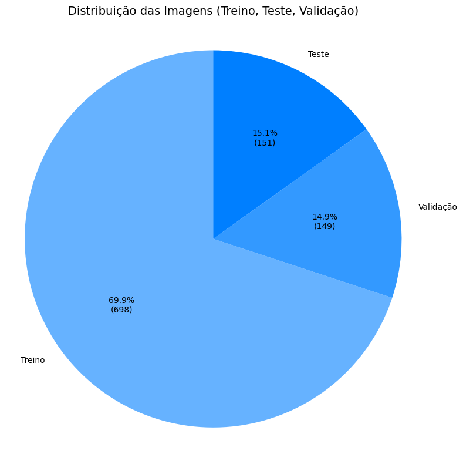
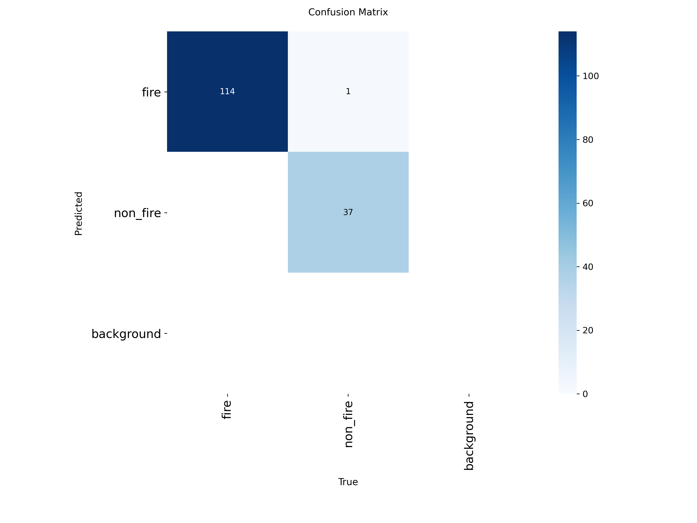
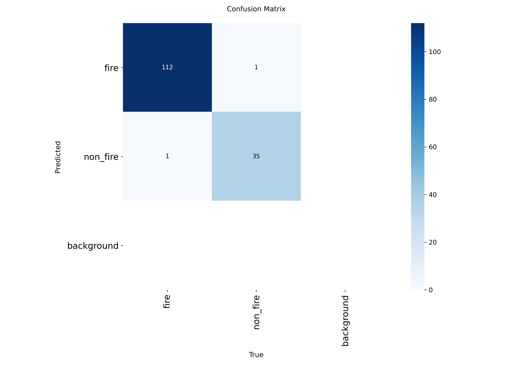

# 🔥 Classificação Binária da Presença de Fogo em Imagens com Yolov11
Este repositório tem por objetivo apresentar um projeto desenvolvido para a disciplina de graduação, Visão Computacional, que consiste em aborda uma solução para a classificação da presença de fogo em imagens usando o YOLOv11.

## 📌 Introdução
Em 2024, o Brasil registrou 278,3 mil focos de incêndio, segundo o Inpe, que representa um aumento de 46,5%, em relação ao ano anterior. De modo que a detecção precoce desses principios de incêndio é essencia para uma resposta rápida e eficaz, minimizando os danos causados. Para que isso aconteça é necessário um monitoramento automático de incêndio por meio de imagens. Nesse contexto, a aplicação de soluções baseadas em visão computacional e aprendizado de máquina tem se mostrado eficiente para a detecção precoce de focos de incêndio em imagens capturadas por satélites, câmeras fixas ou drones.

Este trabalho apresenta o desenvolvimento de um aplicação de classificação de imagens que identifica a presença ou ausência de fogo, utilizando a arquitetura YOLOv11, um modelo especifico para classificação de imagens. O objetivo é treinar esse modelo para classificar imagens em duas categorias: "fire" e "non_fire".

## ⚙️ Metodologia
Para a realização da tarefa de classificação binária de imagens, foi utilizado o [Fire Dataset](https://www.kaggle.com/datasets/phylake1337/fire-dataset), disponibilizado na plataforma Kaggle. O conjunto de dados é composto por 999 imagens divididas em duas classes: `fire_images` (imagens contendo fogo) e `non_fire_images` (imagens sem ocorrência de fogo). As imagens contemplam uma ampla gama de cenários, incluindo ambientes naturais (como florestas) e urbanos (como edificações, residências, veículos e rodovias), o que contribui para uma maior robustez na generalização do modelo.
A seguir, é exibida uma amostra representativa do dataset, gerada por um script automatizado responsável por selecionar imagens aleatórias da base.

### 🗂️ Distribuição do Dataset
O processo teve início com o download da base de dados e sua reorganização no formato exigido pelo YOLO, com as imagens distribuídas em subpastas para treinamento, validação e teste. O conjunto original foi, então, dividido aleatoriamente em três subconjuntos: treinamento (70%), validação (15%) e teste (15%). O gráfico abaixo ilustra essa divisão:

A divisão foi realizada com auxílio de um script que aloca aleatoriamente as imagens entre os três subconjuntos. A distribuição final das imagens ficou da seguinte forma:

| Classe     | Treino | Validação | Teste |
|------------|--------|-----------|-------|
| `fire`     | 528    | 113       | 114   |
| `non_fire` | 170    | 36        | 38    |

### Pré-Processamento de dados

As imagens passaram por um processo de pré-processamento, sendo automaticamente redimensionadas para 640×640 pixels, conforme o parâmetro `imgsz`, e normalizadas com os valores de pixel convertidos para o intervalo `[0, 1]`, como exigido pelo pipeline da Ultralytics. Técnicas leves de data augmentation foram aplicadas automaticamente, incluindo espelhamento horizontal aleatório, corte e alterações de brilho e contraste, contribuindo para uma melhor capacidade de generalização do modelo.

Inclui também no pré-processamente a etapa mencionada anteriormente, particionamento do conjunto de dados em treinamento (70%), validação (15%) e teste (15%).

### Arquitetura do modelo
A arquitetura selecionada para a tarefa de classificação de imagens foi a YOLOv11 (You Only Look Once, versão 11), com ênfase no modelo `yolo11n-cls.pt`, previamente treinado para tarefas de classificação. Esta versão é adaptada para classificação pura e mostra-se adequada para cenários com dados limitados e distribuição desbalanceada entre as classes.

A tarefa desenvolvida consistiu em uma classificação binária, com o objetivo de identificar a presença (fire) ou ausência (non_fire) de fogo em imagens. O modelo foi refinado para capturar padrões visuais característicos de incêndios, como a presença de chamas, coloração avermelhada e fumaça.

### **Ferramentas e Bibliotecas Utilizadas**

O desenvolvimento e a execução do projeto foram realizados com o suporte das seguintes ferramentas e bibliotecas:
* **YOLOv11 (Ultralytics):** Framework utilizado para implementação da arquitetura e gerenciamento da pipeline de treinamento;
* **PyTorch:** Biblioteca de aprendizado profundo empregada na modelagem e execução da rede neural;
* **Python 3.10:** Linguagem de programação principal utilizada no projeto;
* **Google Colab (GPU Tesla T4):** Ambiente de desenvolvimento com suporte à aceleração por GPU, facilitando o treinamento do modelo;
* **Matplotlib**: Bibliotecas para visualização de dados e análise gráfica dos resultados.
  
Essa infraestrutura possibilitou um fluxo de trabalho eficiente e reprodutível, além de oferecer suporte para o monitoramento detalhado do desempenho do modelo.

### Treinamento e Avaliação do Modelo

O treinamento foi conduzido usando os seguintes principais parâmetros:
* `model='yolo11n-cls.pt'` – Modelo base pré-treinado para classificação;
* `data=data.yaml` – Arquivo de configuração com caminhos para os conjuntos train, val e test;
* `epochs=25` – Número total de épocas para treinamento;
* `batch=16` – Tamanho do lote (batch size);
* `imgsz=640` – Resolução das imagens (640x640 pixels);

Durante o treinamento, o modelo foi capaz de aprender rapidamente os padrões visuais relacionados à presença de fogo, com melhora significativa das métricas já nas primeiras épocas. 

  

Após o treinamento, a performance do modelo foi avaliada automaticamente com base nos seguintes indicadores:

* **Loss** – Perda (erro) da predição ao longo das épocas;
* **Top-1 Accuracy** – Percentual de acertos considerando a classe mais provável;
* **Top-5 Accuracy** – Percentual de acertos considerando as 5 classes mais prováveis (embora a tarefa seja binária);
* **Confusion Matrix** – Representação visual dos acertos e erros por classe.

Além disso, o modelo foi testado sobre o conjunto separado de imagens (`test`) para avaliar sua capacidade de generalização, e os erros cometidos foram analisados individualmente, com imagens incorretamente classificadas sendo exibidas para análise qualitativa.

## 📊 Resultados e Discussões
Ao final do treinamento, o modelo **YOLOv11** apresentou desempenho satisfatório, com taxa de erro residual mínima. A figura a seguir mostra a evolução das curvas de loss e acurácia ao longo das épocas. Nota-se que o **loss** de treino teve uma queda consistente, enquanto o de validação caiu rapidamente nas primeiras épocas e estabilizou-se próximo de zero. Já a **acurácia top-1** evoluiu positivamente, superando 97%, enquanto a **acurácia top-5** manteve-se constante em 100%.

  

A acurácia final no conjunto de treinamento foi de **98,7%**. Para avaliar o desempenho após o treinamento, a rede foi testada com o conjunto de teste, e a matriz de confusão obtida demonstra a seguinte performance:

  

A partir da matriz, observa-se que o modelo classificou corretamente 114 de 115 imagens da classe `fire` e 36 de 38 da classe `non_fire`, o que corresponde a uma acurácia de aproximadamente **94,7%**. Esses resultados indicam uma excelente capacidade de generalização para imagens não vistas anteriormente. Considerando a divisão aleatória do dataset, o modelo mostrou-se robusto, com ótimo desempenho mesmo em cenários variados de iluminação e perspectiva.

Além disso, foi realizada uma comparação entre as matrizes de confusão dos conjuntos de treinamento e teste, como mostrado a seguir:

 <table> <tr> <td align="center"><strong>Treinamento</strong> </td> <td align="center"><strong>Teste</strong> </td> </tr> </table> 

A seguir, é apresentada uma imagem com alguns dos resultados de classificação do modelo:

  

A análise mostra que o modelo manteve desempenho semelhante entre as fases, com uma leve oscilação nos falsos positivos e falsos negativos. A ausência de predições para a classe background em ambas as fases sugere a possibilidade de reavaliar a representação dessa categoria nas anotações ou sua real necessidade no modelo.

A seguir, é apresentada uma imagem com alguns dos resultados de classificação do modelo:

  

Foi identificado apenas um caso de erro de classificação, ilustrado na imagem abaixo.

  

## Conclusão
Os resultados alcançados foram possíveis devido a utilização do YOLOv11 na tarefa de classificação aliado ao otimizador Adam, permitindo encontrar um desempenho robusto sem a necessidade de arquiteturas complexas ou alto custo computacional. Em trabalhos futuros, pode-se expandir essa aplicação para a detecção localizada de focos de incêndio em tempo real (objeto + bounding box), incorporando variações climáticas e contextos diversos. 

